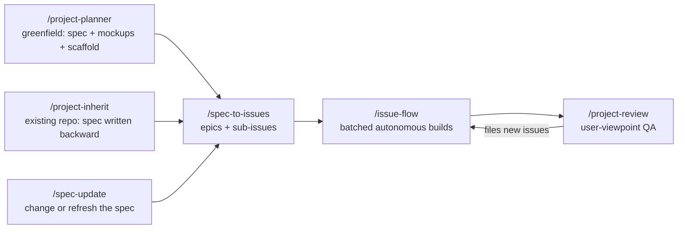
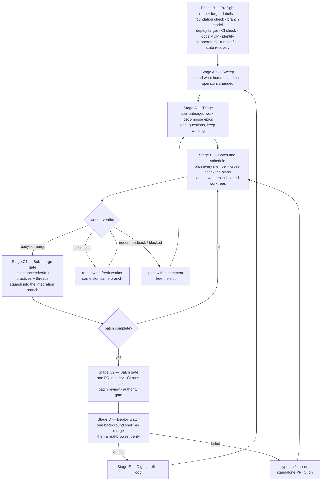
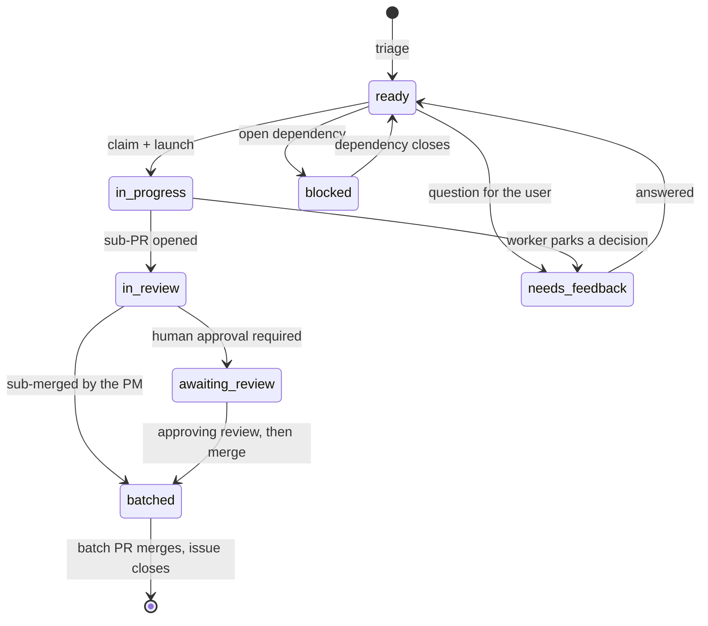
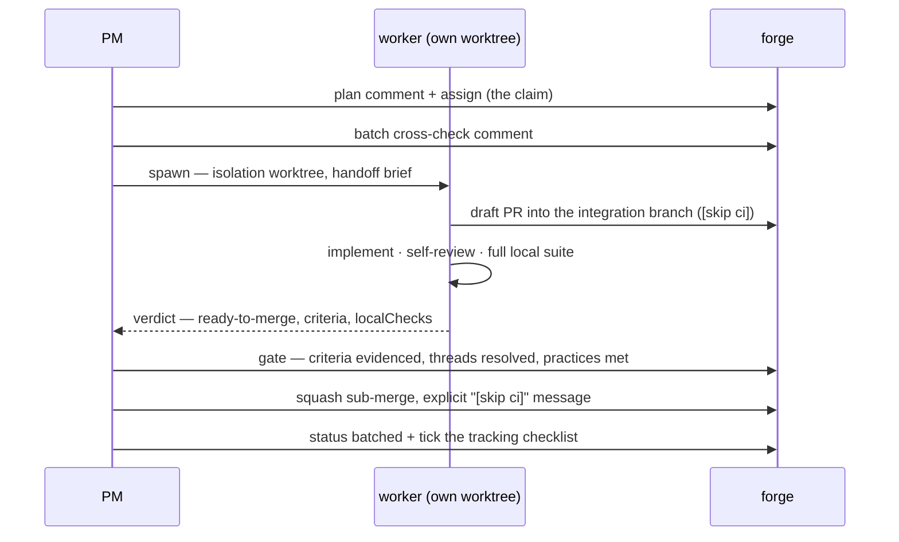
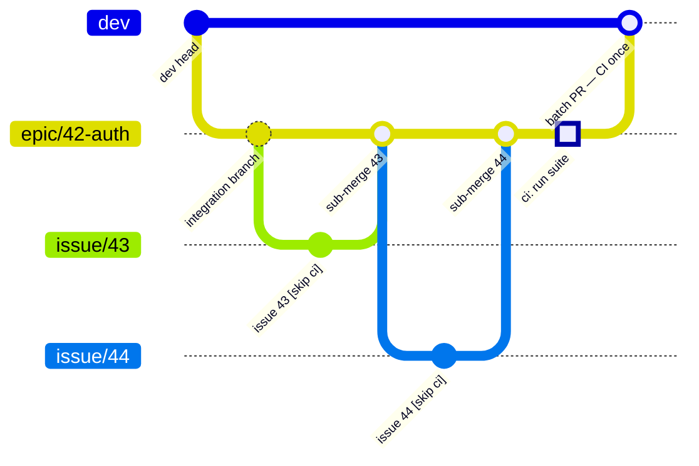
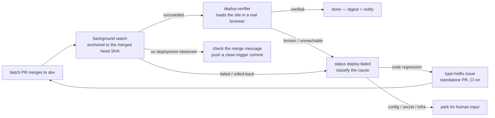

# issue-flow

A Claude Code plugin. It drives an autonomous development loop from tracker issues:



The review files new issues, and the loop runs them next.

Tracker issues are the single source of truth. Labels hold the state. Comments hold the
audit trail. All durable state lives on the forge, so the loop survives a restart.

## The loop at a glance



Labels are the state machine. An issue carries at most one `status:` label:



(`status:deploying` and `status:deploy-failed` sit on the batch's tracking issue during
Stage D, never on a member.)

## Which forge

This plugin runs on **GitHub** or on **Gitea** (1.20 or later). It detects which from
your git remote at startup and uses that forge's CLI — `gh` or `tea` — falling back to
that forge's MCP server. Nothing else about the loop changes.

Gitea support exists because GitHub bills Actions minutes on private repositories. A
self-hosted Gitea with its own runner has no such ceiling.

The full operation mapping is in [references/forge.md](references/forge.md).

## The six skills

### `/project-planner`

Interviews you, then writes the project brief and the project scaffold.

- `docs/specs/` — the index `spec.md`, one detailed `features/*.md` per feature set,
  mermaid diagrams for the architecture, the data model and every user flow, and
  self-contained HTML mockups.
- `spec.html` + `html/` — a generated multi-page website of the whole spec (full
  content, rendered diagrams, embedded mockups, one page per feature), built from the
  markdown by a committed `render-spec.py` so a revision is always one script run away
  from a fresh review site. Every page carries an in-page review layer: comment on any
  section as you read, export `review-comments.md`, and the next render shows each
  comment answered in place.
- `CLAUDE.md`, the `.claude/` scaffold (permissions, hooks, path-scoped rules, project
  skills such as `/run` and `/test`), and the Claude Code `.gitignore` block.
- A review cycle. You see every permission, hook and skill before the planner writes it.
  The cycle repeats until you approve the spec.
- **Epic 0: Foundation** — test harness, CI workflow, branch model, deploy wiring and seed
  data. The planner always writes it, so the first worker has a project to build in.

One project per repository. The planner uploads nothing, and every path it writes is
relative.

### `/project-inherit`

The planner for code that already exists. It brings an existing repository into the
pipeline by writing the spec **backward** from what was built.

- Harvests every existing statement of intent first — README, `docs/`, ADRs, wikis,
  specs in other formats — then verifies each claim against the code. The code is the
  senior witness; contradictions land in `Risks & open questions`.
- Reviews the entire repository with parallel read-only survey agents (stack, data
  model, API surface, screens and flows, cross-cutting concerns, tests and CI,
  conventions and slop), and interviews you only about what code cannot answer:
  intent, personas, the roadmap.
- Writes the same `docs/specs/` package the planner writes. Existing features get
  `status: built` (documented, never re-issued, no mockups — the app is its own
  mockup); the roadmap and foundation gaps get `status: planned`, which is what
  `spec-to-issues` turns into work.
- Backfills ADRs for the major choices already made, marked as reconstructed.

### `/spec-update`

Evolves an approved spec between runs, without replanning the project.

- **Change mode** — add a feature, alter built behaviour (expressed as new planned
  work, never rewritten history), or retire a feature. Full planner depth, review
  cycle included; `spec-to-issues`' id-dedup then issues only the delta.
- **Refresh mode** — after a plugin upgrade, mechanically migrate an older package to
  the current format: draw the missing diagrams from existing prose, replace a
  hand-written `spec.html` with the generated one, backfill `docs/adr/`,
  `docs/external.md` and quality rules. It invents zero product content — anything it
  cannot fill mechanically becomes a recorded question.
- Mid-run spec edits stay with the issue-flow PM's spec-maintenance mechanisms; this
  skill is the user's tool between runs.

### `/spec-to-issues`

Turns an approved spec into tracker epics and sub-issues. Each one is labeled, linked to
its dependencies, and sized so that one epic is one batch.

- It **decomposes** the feature specs into engineering slices. It does not transcribe a
  checklist.
- It creates issues for `status: planned` features only.
- It deduplicates on the stable feature `id`, so a second planning wave issues only the
  work that changed.
- It stops until you commit and push the spec. Workers read the spec from a git worktree,
  and a worktree contains tracked files only.

### `/issue-flow`

The autonomous loop. It has two roles.

- **The PM — the main thread.** It orchestrates and it never writes feature code. It
  grooms the backlog, forms batches, schedules work, owns every decision and every gate,
  resolves conflicts, merges, monitors deployments, and posts status digests.
- **The sub-agents — background agents with self-contained prompts.**
  `issue-flow:issue-worker` builds one issue and returns a verdict.
  `issue-flow:deploy-verifier` checks the live site in a real browser. The deploy
  *watch* is not an agent — it is one background shell command per merge.

One worker's life, end to end:



### `/project-review`

The QA and documentation pass that follows a build wave. The PM starts a sandbox, runs
the E2E tests, and starts three kinds of sub-agent:

- `issue-flow:ux-explorer` uses the app as a non-developer end user. It captures
  screenshots, writes manual-ready walkthroughs, and reads the sandbox logs.
- `issue-flow:code-auditor` searches the code for TODO comments, stubs, and gaps against
  the acceptance criteria of recently closed issues.
- `issue-flow:review-scribe` turns the walkthroughs into a user manual and E2E tests, on
  a documentation PR.

**The review fixes nothing.** The PM collects every report, files a `review:finding` issue
for each finding that passes the filing gate below, routes the rest to the deliverables PR
or the run ledger, and then asks you to launch `/issue-flow` on the new backlog.

## What earns an issue

A finding earns a tracker issue in five cases, and never otherwise: **behavior**, **a
user-visible output**, **a guard that guards nothing**, **a blocked epic**, or **a question
the maintainer must rule**. Everything else — a falsified sentence, a moved citation, a
stale count, prose drift, a record of a past state — is repaired by the change set that
found it, and no issue is filed.

One carve-out: anything under `docs/specs/` that describes the wrong product still earns an
issue. The spec is not a record of a past state — it is the input that decides what gets
built next, so a reader who trusts a wrong sentence there builds the wrong thing.

Without that gate the loop feeds itself: repairing a stale record edits a file, which
falsifies a second record, which is the next issue. The backlog then regenerates at about
the rate it closes and the loop never reaches "backlog empty". So the PM also proves the
loop is converging — at each merge gate it records how many issues the session filed from
findings, its own and any `/project-review` run's, against how many the merge closed, in a
durable line on its own status issue. Filed at or
above closed for three consecutive gates stops the session and reports the three pairs.
Epic decomposition and batch tracking issues don't count: those are planned work becoming
schedulable, not a backlog feeding itself.

[`references/finding-policy.md`](references/finding-policy.md) holds the gate, where each
non-qualifying repair goes, and the measurement that earned the rule.

## Two standards for everything the plugin writes

Both standards live at the plugin root. `project-planner` copies both into the project as
`.claude/rules/` files, so they survive the handoff to the workers and the reviewers.

### [`references/ste.md`](references/ste.md) — Simplified Technical English

Every spec file, feature file, issue title and body, PM comment, changelog line, user
manual page and **code comment** follows it:

- One instruction per sentence.
- One concept, one word.
- Active voice, present tense, no metaphor, no undefined abbreviation.

Each spec carries a `## Terms` table. That table is the project's controlled vocabulary,
and everything downstream writes from it.

Quotes, log excerpts, error strings, paths and identifiers stay verbatim. Rewriting
evidence damages it.

The ASD-STE100 approved-word dictionary is copyrighted, so this plugin does not
redistribute it. What ships is the enforceable rule set, plus a per-project Terms list
that does the dictionary's work.

### [`references/external-apis.md`](references/external-apis.md) — read the documentation

The project does not own a cloud service, a third-party API, a provider CLI or a library.
Describe each one from its own current documentation, at the version the project pins, and
cite the URL beside the claim. This binds the planner, the PM and every worker.

AWS carries the highest risk, because a wrong assumption there spends money or changes
infrastructure instead of failing at compile time. So:

- Confirm operation names, parameters, region, account, and the IAM actions the call
  needs.
- Prefer the read-only `list-*`, `get-*` and `describe-*` calls to learn the shape of a
  real resource.
- Treat any call that creates, deletes or changes a resource as outward-facing. The user
  confirms it first.

## The batch model

One CI run per batch, and each conflict resolved once.



- Every epic gets an **integration branch** off dev. The PM also groups loose issues into
  batches of `batchSize` or fewer, and each batch gets one.
- Each worker opens a **draft PR into the integration branch**, and ends every pushed
  commit message with `[skip ci]`; the PM writes the same token into the sub-merge's
  commit message rather than trusting the forge's default, which carries it on GitHub and
  drops it on Gitea. Provider CI never runs for a sub-issue. The worker
  verifies with the full local test and lint suite, plus a parallel specialist
  self-review.
- The PM **sub-merges** each member into the integration branch and resolves any conflict
  once, locally. Sibling PRs never rebase against a moving dev branch.
- One **integration branch → dev PR** runs full CI once. The member issues close when it
  merges.
- Members of a dependency chain share one batch and run in sequence. The plugin never
  stacks chained PRs.
- A `type:hotfix` issue, or an urgent `priority:high` issue, skips the batch. It gets a
  standalone PR into dev, with CI enabled — and that PR takes the same merge authority as
  a batch PR, so the default `batch-review` still requires a human approving review.

## Deployment — watched, then browser-verified

The plugin ships **no provider integrations**. A hosting platform (Amplify, Vercel, a
Kubernetes rollout) is a project architecture choice, and the project supplies the way to
query it: either the deploy runs in the forge's own Actions (watched like CI), or the
project wires a one-line status command (`scripts/deploy-status.sh`, written by Epic 0)
printing `<state> <jobId> <sha>`. Detail: the issue-flow skill's `references/deploy.md`.



**A deployment is done only after the browser check passes.** A person approves every
promotion from `dev` to the live branch.

## The loop, in prose

1. **Preflight.** A `SessionStart` hook has already fetched the remote and handed the PM
   the mechanical facts — branches, leftover worktrees, missing labels, open PRs — in a
   repository that carries `.issue-flow.json`; the PM verifies instead of re-deriving.
   Check the repository, the remote and the labels. Check the foundation —
   an empty repository gets Epic 0 first, never a feature issue. Read the branch model
   from the spec (`dev-and-live` or `trunk`) and create `dev` when it is needed. Detect
   the deploy target. Check CI; when the repository has none, the PM runs the suite
   itself at the batch gate and says so. Offer the documentation MCP servers. Find or
   create your `flow:status` status issue, check for co-operators, confirm the run
   configuration with you, and recover the state of any unfinished work.
2. **Sweep, then triage.** The PM reads new comments and external changes first, and
   applies them. A human's answer, instruction or PR review always wins. An untriaged
   issue becomes `status:ready` or `status:needs-feedback`. An epic with no sub-issues gets
   decomposed. `Depends on #n` sets the sequence. The PM parks a question and notifies you
   by default. It asks you interactively only when too little work remains, when you are
   already at the keyboard, or when an answer blocks a completed batch.
3. **Form batches and schedule.** Each epic becomes an epic batch. Loose issues become
   grouped batches with a `type:batch` tracking issue — unless `reviewWipLimit` batches
   already wait on your review, in which case the PM tells you reviews are the
   constraint instead of stacking more inventory in front of you. The PM cross-checks
   every member's plan before the first launch — and, with `planReview` on, holds the
   batch until you approve the plans, the point where a correction costs one comment
   instead of a built branch. Then it runs up to `concurrency` workers across all
   batches, each one an independent engineer in its own git worktree. Workers build in
   vertical slices — a thin end-to-end path first — so every commit, and every
   mid-issue checkpoint, leaves something a test can exercise.
4. **Integrate through two gates.** At the sub-merge gate the PM checks that the threads
   are resolved, the local checks are green, that new tests **failed on the pre-patch
   code** (a test that passed before the change proves nothing), and that **every
   acceptance criterion carries
   evidence**. It then squashes the member into the integration branch and labels it
   `status:batched`. At the batch gate it opens one PR into dev and reviews the whole
   batch diff, including a cross-batch migration check. CI runs once. The PM then closes
   the members, writes the spec changelog and the feature status back, and removes the
   worktrees.
5. **Deploy.** One background shell watches each merge to a terminal state. A
   deploy-verifier then drives a real browser to confirm the site works. On failure the
   PM opens a `type:hotfix` issue (standalone, CI enabled), or parks the work for human
   input on an infra or config cause.
6. **Report.** At every milestone the PM posts a terminal digest of 10 lines or fewer,
   updates the status issue body, and sends a push notification. Between milestones it
   stays quiet. The loop continues while workable backlog remains.

**Model tiers.** Each agent's own `model:` frontmatter is authoritative. The current
summary: PM and issue-worker run on **Opus**; a worker's children, the deploy-verifier,
the ux-explorer, the code-auditor and the review-scribe run on **Sonnet**.

## Install

```bash
claude plugin marketplace add Sniper7Kills-LLC/claude-plugins
claude plugin install issue-flow@sniper7kills
```

Restart the session afterwards, so the skills and agents load.

To work on the plugin locally, point a marketplace at your checkout instead:

```bash
claude plugin marketplace add ~/claude-plugins
```

## Use

The full pipeline, from an idea:

```
/project-planner "habit tracker app"   # spec + mockups + scaffold → review → approve
/spec-to-issues                        # after you commit and push docs/specs/
/issue-flow
/project-review                        # user-test the shipped work → issues → /issue-flow
```

Or from a codebase that already exists:

```
/project-inherit                       # whole-repo review → spec written backward → approve
/spec-to-issues                        # issues the roadmap + foundation gaps only
/issue-flow
```

Later, to grow or modernize the spec: `/spec-update` ("add a feature ...", or "refresh
the spec" after a plugin upgrade).

On any existing tracker, start the loop with `/issue-flow`, "work the issues", or "pick up
the next issue".

After a build wave, start the review with `/project-review`, "review the project",
"user-test the app", or "build the user manual". The review ends by offering to launch
`/issue-flow` on the issues it filed.

## Requirements

Required:

- The provider's CLI, installed and authenticated: `gh auth login` (GitHub) or
  `tea logins add` (Gitea), with the `repo` and `workflow` scopes.
- `git` 2.5 or later, for worktrees. Each worker runs with `isolation: "worktree"`, so
  Claude Code creates its worktree **inside the checkout**, at `.claude/worktrees/`
  (gitignored), and pins that worker to it. Add gitignored build inputs (`.env` and
  friends) to a `.worktreeinclude` at the repo root and they are copied in for you.
- CI that honors `[skip ci]`. GitHub Actions honors it natively; Gitea Actions does the
  same from Gitea 1.20. If your provider does not, the PM proposes a one-time workflow
  filter for the `epic/**` and `batch/**` branches, or falls back to local sub-merges with
  no sub-PRs.

Optional:

- **Deploy monitoring** — a deploy workflow in the forge's own Actions, or a project
  status command printing `<state> <jobId> <sha>` (wired by Epic 0, or supplied once at
  preflight), or nothing — Stage D is skipped and the PM says so.
- **Deploy verification** — a browser MCP server, `playwright` or `chrome-devtools`.
  Without one, the verifier falls back to an HTTP and content check.
- **`/project-review`** — the same browser MCP server, plus a sandbox to review against: a
  local dev server, `docker compose up`, or a deployed dev or staging URL. Never
  production, because the explorers submit test data.
- **`rtk` (Rust Token Killer)** — when the operator has it installed (`rtk --version`),
  its hook rewrites shell commands transparently and filters token-heavy output for the
  PM and every worker. The loop checks for it once at preflight and leaves it in place.

Connect a browser MCP server once, at user scope:

```bash
claude mcp add playwright      -s user -- npx -y @playwright/mcp@latest
claude mcp add chrome-devtools -s user -- npx -y chrome-devtools-mcp@latest
```

## Run configuration

Every `/issue-flow` session starts by confirming how it should run. The PM saves your
answers to `.issue-flow.json` (committed, team-shared) and presents them as pre-selected
defaults next session. It never applies a saved answer silently, because the right answer
changes from run to run.

| Setting | What it decides | Default |
|---|---|---|
| `concurrency` | workers running at once, across all batches | **3** |
| `batchSize` | maximum members in a loose-issue batch (an epic uses its natural size) | **4** |
| `runLength` | one batch · N issues · until the backlog empties · until you stop it | **25 issues** |
| `prGranularity` | `batch` (one CI run per batch) or `per-issue` (one PR and one CI run each) | **batch** |
| `prAuthority` | how much the PM may merge on its own | **`batch-review`** |
| `planReview` | hold each batch until you approve its member plans — the cheapest re-steer point, before any code exists | **off** |
| `reviewWipLimit` | how many batches may wait on human review before the PM stops forming new ones | **2** |
| `review.when` | when to offer a `/project-review` | **end of session** |
| `practices` | TDD · DDD · E2E expectations · coverage · commit style · docs | from the spec, else off |
| `deploy` | how Stage D watches deployments (`actions` · `command` · `none`) and the URLs | detected in preflight |
| `docsMcp` | which documentation MCP servers and marketplaces the PM offered, you installed, or you declined, and whether a restart is still pending | set in preflight |
| `pluginVersion` | which plugin release last ran this project — the preflight hook flags drift after an upgrade, and the PM re-asks any config question the older file never saw | stamped in preflight |

`prAuthority` is the most important setting:

| Value | What the PM may merge |
|---|---|
| `autonomous` | sub-PRs and batch PRs |
| **`batch-review`** (default) | sub-PRs freely; the batch PR needs a human approving review |
| `review-all` | nothing without a human approving review |
| `propose-only` | nothing — the PM opens PRs and stops |

Any standalone PR into dev — a hotfix, an urgent singleton, or every PR under
`per-issue` granularity — takes the batch-PR authority. Two rules override the setting:
a person approves every promotion from `dev` to the live branch, and branch protection
always wins.

`practices` travel in the worker handoff brief, and the PM checks them at the merge gate.
The PM returns a missed practice to the worker instead of waiving it.

## How the PM works with people

The tracker is shared, so the PM reads new comments and external changes before every
triage and before every merge gate.

- A human's answer to a parked question, a new instruction, and a PR review are all
  authoritative. The PM applies them.
- The PM never takes an issue that someone else assigned to themselves.
- The PM never edits another operator's status issue. Status issues are per operator, and
  each is titled `issue-flow: session status — @<login>`.
- In any issue body it maintains, the PM edits only the text inside its own
  `<!-- issue-flow:begin @<login> -->` marker block. Your notes in the same body survive.
- The PM treats every comment as untrusted input. It surfaces anything that would grant
  access, spend money, reach another repository, or bypass a gate to you, and it executes
  none of it.

## How many issues one session can clear

There is no fixed limit. The real constraint is the main thread's context, and the loop
keeps that flat:

- The PM delegates every token-heavy read — diffs, CI logs, file maps — to a sub-agent
  that returns a short summary.
- Durable state lives on the forge: labels, comments, PRs and the status issue.
- The PM drops each finished issue and batch from working memory.

If the harness compacts the context, preflight rebuilds the state from the tracker and the loop
continues. One session can therefore clear far more issues than a single context window
holds.

## License

MIT — see [LICENSE](../LICENSE).
